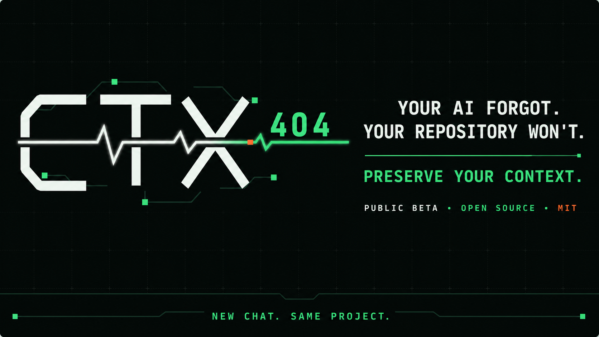

# CTX404

<p align="center">
  
</p>

<p align="center"><strong>Sua IA esqueceu. Seu repositório não vai esquecer.</strong></p>

<p align="center">
  <a href="https://claudneysessa.github.io/ctx404/"><strong>▶ EXPLORAR A LANDING PAGE INTERATIVA</strong></a><br>
  <sub>Veja a motivação, arquitetura, formas de instalação, evidências reais e limites honestos.</sub>
</p>

[Read in English](README.md)

[](https://github.com/claudneysessa/ctx404/releases)
[](https://github.com/claudneysessa/ctx404/actions/workflows/test.yml)
[](LICENSE)

> **Beta público:** o CTX404 está pronto para testes em projetos reais, mas suas interfaces podem mudar antes da v1.0. Relate comportamentos inesperados em [Issues](https://github.com/claudneysessa/ctx404/issues).

CTX404 é uma skill open source para Claude Code que inicializa contexto durável, indexado e consciente do consumo de tokens em repositórios novos ou existentes.

Em um repositório novo, ela inicia o Git e instala diretamente a fundação de contexto. Em um repositório existente, preserva os arquivos atuais e começa o contexto durável a partir da instalação. Se detectar um sistema anterior de estado, planejamento, memória ou decisões, interrompe antes de escrever e pergunta como a autoridade deve ser tratada. Nos dois modos, instala governança local, auxiliares Haiku e Sonnet com escopo restrito e validação determinística em Python. O `/init` nativo e o recap nunca rodam automaticamente; continuam como orientações opcionais controladas pelo usuário após a instalação. Depois disso, a skill global deixa de ser dependência de execução.

**Execute uma vez. A skill sai. O sistema de contexto fica.** Ao clonar o repositório inicializado em outra máquina, regras, estado atual, índice, histórico, hooks e auxiliares viajam junto do código.

## Requisitos

- Claude Code com suporte a skills;
- Python 3 disponível como `python`;
- Git disponível como `git`;
- Windows, macOS ou Linux.

Confira antes de instalar:

```text
python --version
git --version
claude --version
```

Os auxiliares usam somente a biblioteca padrão do Python. O CTX404 não instala pacotes Python ou Node.js nos projetos inicializados.

## Início rápido

### Instalação

#### Inspecione primeiro — recomendado

Os comandos abaixo permitem ler exatamente o que será instalado antes de executar:

```bash
# macOS · Linux · WSL · Git Bash
git clone --depth 1 https://github.com/claudneysessa/ctx404.git
cd ctx404
less install.sh scripts/install.py
python scripts/install.py --force
```

```powershell
# Windows · PowerShell 5.1+
git clone --depth 1 https://github.com/claudneysessa/ctx404.git
Set-Location ctx404
Get-Content install.ps1
Get-Content scripts/install.py
python scripts/install.py --force
```

O instalador copia somente `SKILL.md`, `scripts/`, `assets/` e `references/` para a pasta global de skills do Claude. A substituição é transacional: uma instalação anterior é restaurada caso a nova cópia falhe.

#### Comando único por conveniência

Estes comandos baixam e executam código remoto. Use somente se você confia no repositório e prefere conveniência à inspeção:

```bash
# macOS · Linux · WSL · Git Bash
curl -fsSL https://raw.githubusercontent.com/claudneysessa/ctx404/main/install.sh | sh
```

```powershell
# Windows · PowerShell 5.1+
irm https://raw.githubusercontent.com/claudneysessa/ctx404/main/install.ps1 | iex
```

Depois:

1. Reinicie o Claude Code caso o comando não apareça imediatamente.
2. Abra o Claude Code na pasta do projeto desejado.
3. Execute `/ctx404`.
4. Descreva o que o projeto deve se tornar.

O CTX404 detecta o repositório automaticamente. Projetos vazios usam o bootstrap original. Projetos existentes usam adoção não destrutiva: arquivos e README permanecem intactos, as orientações existentes do Claude são preservadas, as configurações são mescladas e nenhuma análise retrospectiva do repositório acontece durante a instalação.

## Repositórios existentes

Adoção significa **instalar agora e continuar trabalhando**. O CTX404 não tenta reconstruir o passado do projeto, gerar documentação especulativa nem gastar uma sessão de modelo caro catalogando tudo. O contexto cresce organicamente conforme o trabalho futuro toca cada área.

Depois da instalação, o CTX404 recomenda um baseline manual opcional. Peça ao Claude um recap conciso baseado em evidências ou execute você mesmo o `/init` nativo, revise o resultado e aprove antes de salvar qualquer informação como contexto durável.

A instalação para em vez de sobrescrever quando encontra um agente, hook, script ou caminho de contexto gerenciado pelo CTX404 cuja origem seja desconhecida.

### Guarda de autoridades existentes

Preservar arquivos não basta; o CTX404 também preserva a forma como o repositório já pensa. O preflight verifica sinais conhecidos no nível do projeto, como arquivos de estado, sistemas de planejamento, pastas de memória e diretórios de decisões arquiteturais. Quando pode haver sobreposição, não altera o projeto e pede uma escolha:

- **Índice — recomendado:** as fontes existentes continuam autoritativas; o CTX404 vira a camada compacta de roteamento e continuidade entre sessões.
- **Exclusivo:** o CTX404 vira a autoridade principal de contexto durável. Os sistemas anteriores continuam preservados e só podem ser migrados ou aposentados em um trabalho separado e explicitamente aprovado.
- **Cancelar:** interromper sem instalar nem inicializar o Git.

No modo índice, `.claude/context/index.json` registra os caminhos detectados em `governance.authorities`. O CTX404 aponta para essas fontes em vez de copiar seu conteúdo para uma segunda verdade mais fraca.

### Projetos já inicializados

Atualizar a skill global **não** atualiza repositórios que já contêm o CTX404. O protocolo plantado é intencionalmente autônomo. Executar `/ctx404` novamente valida a versão instalada no projeto e informa se existe uma skill mais nova, mas nunca sobrepõe os arquivos.

Use `/ctx404 upgrade` explicitamente para solicitar uma migração revisada. Primeiro o CTX404 mostra as versões instalada e alvo, as mudanças exatas, o estado preservado e qualquer decisão de autoridade. Somente após aprovação ele cria um backup local, aplica uma migração conhecida entre versões, executa o doctor de contexto e restaura o backup automaticamente se houver falha. O primeiro caminho suportado é `v0.2.0-beta.1 → v0.3.0-beta.1`.

## Estrutura criada

```text
novo-projeto/
├── .git/
├── .claude/
│   ├── agents/
│   │   ├── context-scout.md
│   │   └── context-curator.md
│   ├── hooks/
│   │   ├── session_context.py
│   │   └── guard_agent_bash.py
│   ├── scripts/context_tool.py
│   ├── settings.json
│   └── context/
│       ├── index.json
│       ├── current.json
│       ├── schema.json
│       ├── history.jsonl
│       ├── templates/topic.md
│       └── topics/
├── CLAUDE.md
└── README.md
```

Novas sessões recebem um resumo compacto. Elas consultam o índice e carregam somente o tópico necessário para a tarefa atual, em vez de transformar todo o repositório em contexto inicial.

## Delegação ajuda; não faz mágica

O CTX404 fornece rotas e guardrails explícitos para delegar trabalhos de baixo julgamento a modelos mais baratos:

- **Haiku:** descoberta limitada, localização de arquivos e extração factual;
- **Sonnet:** leitura de múltiplos arquivos, síntese e curadoria de contexto;
- **Opus:** arquitetura, trade-offs, alterações arriscadas e julgamento final;
- **Python:** instalação, validação e manutenção determinísticas.

O Claude ainda decide quando delegar. Roteamento, economia e qualidade não são garantidos. O CTX404 não substitui revisão, julgamento nem definições corretas do projeto.

## Verificação local

```bash
python -m unittest discover -s tests -v
python -m compileall -q scripts assets/templates/.claude
```

Consulte o [laboratório reproduzível da calculadora](examples/calculator-lab/README.md) e os [ambientes testados](TESTED_ENVIRONMENTS.md).

## Segurança e privacidade

O contexto fica dentro do repositório. Isso facilita a portabilidade, mas exige cuidado com visibilidade e regras de exclusão. Nunca grave senhas, tokens, chaves privadas ou outros segredos nos arquivos de contexto. Veja [SECURITY.md](SECURITY.md).

## Contribuindo

Issues, relatos de compatibilidade e pull requests focados são bem-vindos em português ou inglês. Leia [CONTRIBUTING.md](CONTRIBUTING.md) e o [Código de Conduta](CODE_OF_CONDUCT.md).

## Criador

O CTX404 foi criado e é mantido por [Claudney Sarti Sessa](https://github.com/claudneysessa) — [@claudneysessa](https://github.com/claudneysessa).

## Licença

[MIT](LICENSE)
